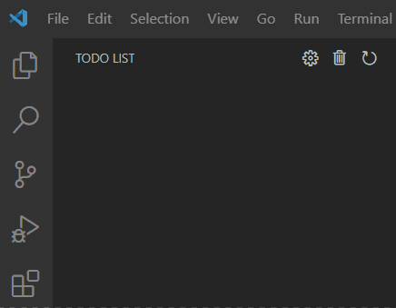
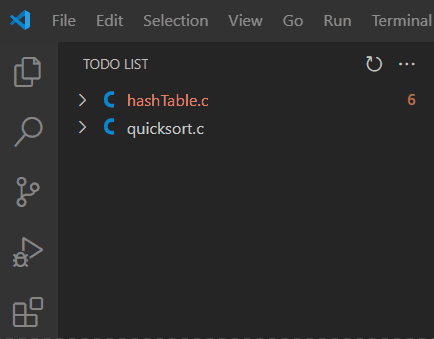
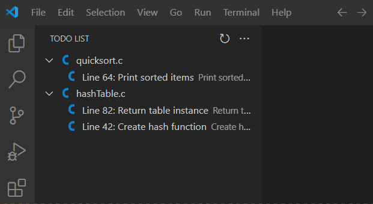
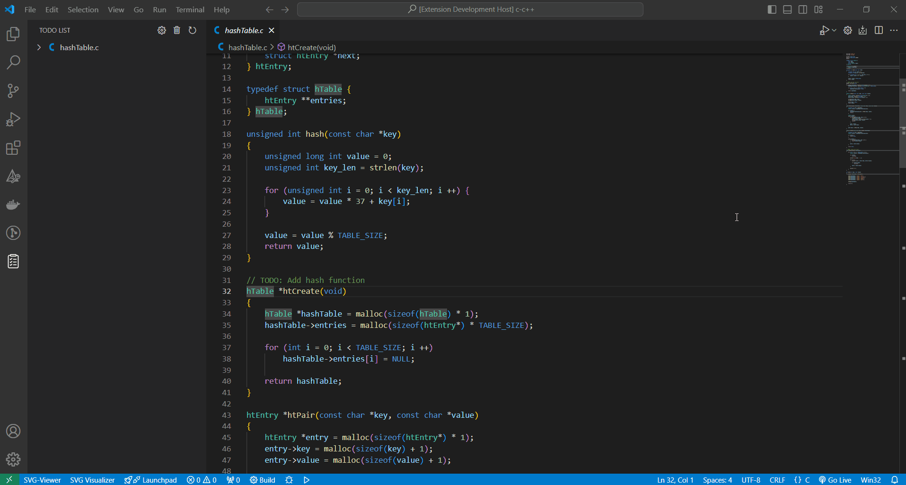

# TODO List Helper for VSCode
🎉 Welcome to the TODO Organizer extension for Visual Studio Code! This extension helps you manage and organize your TODOs efficiently within the editor.

## 🚀 Features
- 📋 List all TODOs: View all your TODO items in one place.
- ➕ Add TODO: Easily add new TODO items.
- ✏️ Open File: Jump to the file and line where the TODO is located.
- ❌ Delete TODO: Remove specific TODO items.
- 🧹 Clear All: Clear all TODO items at once.
- 🔄 Refresh: Refresh the TODO list to ensure it’s up-to-date.

## 💡 How to Use
1. Install the extension from the [Visual Studio Code Marketplace](https://marketplace.visualstudio.com/publishers/Dheovani).
2. Open a folder or workspace in VSCode.
3. Use ALT + ADD (button +) to add a TODO.
    - You can also define your own keybinding. See [Usage](#Usage) bellow for details.
4. In the activity bar, access the TODO List! 📋

## 🛠️ Usage
Once installed, you can access the TODO Organizer from the Activity Bar. The following commands are available:

- 🔄 Refresh: Refresh the TODO list.

- ➡️ Open File: Open the file at the specific TODO.

- ➡️ Open File and Delete: If the opened item doesn't exist anymore, you can delete it

- ➕ Add TODO Item: Add a new TODO item.

- ➕ ... OR just type TODO and i'll add it for you

- 🗑️ Delete Item: Delete a specific TODO item.

- 🧹 Clear: Clear all TODO items.

- ⚙️ Keybinding: Set specific keybinding for add function

## 🤝 Contributing
Contributions are welcome! If you find any issues or have suggestions for improvements, please create an issue or submit a pull request on GitHub.

## 📝 License
This extension is licensed under the [MIT License](LICENSE.txt).

## 📢 Feedback
If you have any feedback or questions, feel free to [reach out](mailto:dheovani_xavier@outlook.com).

I hope you find this extension useful! Happy coding! 🚀